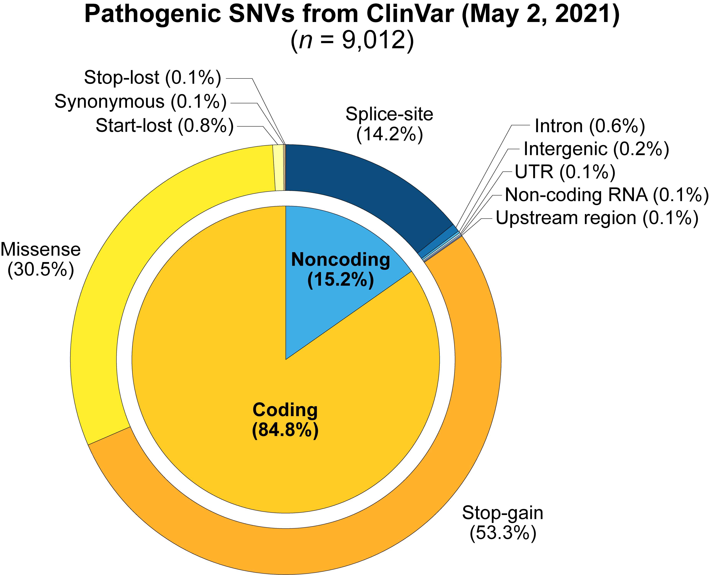

# Annotating pathogenic variants from ClinVar using VEP



This document describes how to generate pie chart visuals summarizing the functional consequences of high-confidence pathogenic SNVs from a given ClinVar release of variants. It is informative to review the functional consequences of ClinVar variants classified by the community as being pathogenic because this can reveal potential ascertainment biases in variant interpretation (e.g., the tendency to classify more coding variants as pathogenic compared to noncoding variants). Here, we define a variant as being "high-confidence" if it has a star rating (proxy for clinical review status) of at least 2 stars. For reference, the star rating system using by ClinVar is summarized below:

|Number of stars|Definition|
|---------------|----------|
|None|The submitter did not provide an interpretation, or the interpretation lacked assertion criteria/evidence|
|One|Either only submitter provided an interpretation with assertion criteria/evidence or multiple submitters of the same variant had conflicting interpretations|
|Two|Two or more submitters for the same variant provided the same interpretation with assertion criteria/evidence|
|Three|The variant interpretations have been thoroughly reviewed by an expert panel (i.e., medical geneticists, molecular pathologists, etc.)|
|Four|The review status of the variant abides by practice guideline assertions (i.e., reviewed by the ClinGen committee)|

## **Dependencies:**
- VEP (v101.0)

## **Step 1: Download the latest release of ClinVar variants**

To download the latest release of ClinVar variants, we can go to the [ClinVar FTP website](https://ftp.ncbi.nlm.nih.gov/pub/clinvar/vcf_GRCh37/) and retrieve the file URL associated with the latest file of variants, which has the name <tt>clinvar.vcf.gz</tt>. Using this URL, we can download the VCF file of variants as follows:
```
wget [URL for clinvar.vcf.gz]
```

## **Step 2: Filter the variant call set to SNVs stratified by clinical significance and clinical review status**

This document will focus on annotating SNVs from ClinVar. To this end, we will need to extract SNVs from this VCF, and we will also want to separate SNVs based on clinical review status. For this purpose, we will define three groups based on ClinVar star rating: (i) "low confidence" (no stars), (ii) "medium confidence" (1 star), (iii) "high confidence" (at least 2 stars). Within each group, we will further stratify SNVs based on their clinical significance. Categories for clinical significance will include:
- Benign
- Benign/Likely benign
- Likely benign
- Conflicting interpretations of pathogenicity
- Uncertain significance
- Likely pathogenic
- Pathogenic/Likely pathogenic
- Pathogenic

To generate VCFs of SNVs organized by "confidence" group and clinical significance category, we have written a Bash script [FilterSNV.sh](./scripts/FilterSNV.sh) that can be executed as follows:
```
bash FilterSNV.sh [/path/to/input/VCF/file] [/mappings/from/clinical/review/status/to/star/ratings] \
    [lower bound for "medium confidence"] [upper bound for "medium confidence"] [/path/to/output/directory]
```

This script assumes that the input VCF file is uncompressed. Moreover, the mappings file (second argument) is a tab-separated file with the following fields:
- **Field 1:** Clinical review status (as it appears in the ClinVar VCF)
- **Field 2:** Number of gold stars

A mappings file connecting clinical review status to star ratings is stored in: <tt>/scr1/users/wangr5/projects/clinvar/clinvar_review_status_star_ratings.txt</tt>

Moreover, there is flexibility in defining what star ratings constitute various confidence categories. For our purposes, when define medium confidence variants as having only 1 gold star, the lower and upper bounds are set to 1. The script will first produce a metafile **parameters.txt** in the output directory that summarizes input arguments. Moreover, the output directory will contain three folders, one for each confidence category. In a given confidence category subfolder, there will be 8 VCF files containing SNVs assigned to a given clinical significance group. 

## **Step 3: Run VEP on high-confidence pathogenic SNVs**

We can next take the set of "high-confidence" SNVs classified as pathogenic and annotate them using VEP to get molecular consequences. We will use the following parameters when annotating variants with VEP:

|Flag|Meaning|
|----|-------|
|<tt>--everything</tt>|Shortcut flag for activating multiple annotation sources (see table below)|
|<tt>--species "homo sapiens"</tt>|We are annotating variants found in a human|
|<tt>--assembly "GRCh37"</tt>|We are using the GRCh37 human reference genome for variant coordinates|
|<tt>--cache --refseq</tt>|Use the NCBI RefSeq database for transcript annotations|
|<tt>--exclude_predicted</tt>|Exclude predicted transcripts in variant annotation|

Summarized below are all of the annotations activated by using the --everything flag

|Annotation|Description|
|----------|-----------|
|--sift|Predicts whether amino acid substitution affects protein function based on sequence homology and amino acid properties|
|--polyphen|Predicts the possible impact of an amino acid substitution on protein structure/function|
|--ccds|Add CCDS transcript ID to output if available|
|--hgvs|Use HGVS nomenclature|
|--symbol|Add HGNC gene symbol|
|--numbers|Add exon and intron numbers|
|--domains|Add names of overlapping protein domains|
|--regulatory|Look for overlaps with regulatory regions (e.g., transcription factor binding site)|
|--canonical|Indicate whether the reference transcript used for variant annotation is canonical|
|--protein|Add Ensembl protein ID|
|--biotype|Add in transcript biotype|
|--uniprot|Add in best match accession ID for translated protein from UniProt|
|--tsl|Add in transcript support level|
|--appris|Add in APPRIS isoform annotation|
|--gene_phenotype|Indicate if the affected gene is associated with a known phenotype (disease or trait)|
|--af|Add in global allele frequency from 1000 Genomes Phase 3 data|
|--af_1kg|Add in allele frequency by continental populations in 1000 Genomes Phase 3|
|--af_esp|Include allele frequency from ESP populations|
|--af_gnomad|Include allele frequency from gnomAD exome populations|
|--max_af|Report the highest allele frequency observed in any of the population databases|
|--pubmed|Report PubMed IDs for publications that cite the given variant|
|--var_synonyms|Report known synonyms for co-located variants|
|--variant_class|Report the sequence ontology of the variant class|
|--mane|Indicate whether the chosen transcript is the MANE Select transcript|

We have written a Bash wrapper script [AnnotateVariants.sh](./scripts/AnnotateVariants.sh) that runs VEP on an input VCF of variant calls using the parameters specified above. This wrapper script can be executed as follows:
```
bash AnnotateVariants.sh [/path/to/input/VCF] [/path/to/VEP/cache] [number of worker threads] [/path/to/output/directory]
```

Following the instructions on Ensembl VEP website (linked [here](https://useast.ensembl.org/info/docs/tools/vep/index.html)), we downloaded a cache of annotations relevant to GRCh37. This cache is currently stored in: <tt>/scr1/users/wangr5/projects/VEP</tt>

## **Step 4: Summarize pathogenic variants by their most severe molecular consequence**

After running the script [AnnotateVariants.sh](./scripts/AnnotateVariants.sh) on our VCF of high-confidence pathogenic SNVs from ClinVar, we will have a summary text file that characterizes the most severe molecular consequences for each input variant. Ensembl's sequence ontologies for molecular consequences can be simplified into the following 10 categories: (i) 5'-UTR, (ii) 3'-UTR, (iii) Downstream genic, (iv) Intergenic, (v) Intron, (vi) Missense, (vii) Non-coding transcript, (viii) Splice regulatory region, (ix) Synonymous, (x) Upstream genic. We have constructed mapping file consisting of two tab-separated fields, with the first column containing raw Ensembl sequence ontologies for molecular consequences, and the second column containing the simplified category. This mapping file is stored in <tt>/scr1/users/wangr5/projects/clinvar/ensembl_variant_SO_map.txt</tt>.

Using this mapping file, we can generate a comma-separated file describing the number of pathogenic SNVs found in each molecular consequence category. This can be achieved using the following Bash code:

```
sed -n -e '/\[Consequences (most severe)\]/,/\[Consequences (all)\]/ p' [/path/to/variant/summary/file] | tail -n +2 | head -n -2 | awk 'BEGIN{
    # Establish which molecular consequences constitute as coding versus noncoding
    x["3'\'' UTR"] = "Noncoding"; x["5'\'' UTR"] = "Noncoding"; x["Downstream"] = "Noncoding"; x["Intergenic"] = "Noncoding";
    x["Intron"] = "Noncoding"; x["Missense"] = "Coding"; x["Noncoding transcript"] = "Noncoding"; x["Splice region"] = "Noncoding";
    x["Synonymous"] = "Coding"; x["Upstream"] = "Noncoding";
}{
    if(FNR==NR){
        y[$1]=$2;
    }
    else{
        printf("%s,%s,%s\n",y[$1],x[y[$1]],$2);
    }
}' [/path/to/mappings/file] - > [/path/to/simplified/variant/summary/CSV]

```

Once we have generated this CSV characterizing the number of pathogenic SNVs in each (simplified) molecular consequence category, we can run the following R code to generate our summary pie charts:

```
# Load in required libraries
library(ggplot2)

# Read in the molecular consequences file as a data frame
df <- read.table([/path/to/simplified/variant/summary/CSV], header=FALSE, sep=",")
colnames(df) <- c("consequence", "group", "count")

# Define a blank theme for our pie charts
blank_theme <- theme_minimal()+
  theme(
  axis.title.x = element_blank(),
  axis.title.y = element_blank(),
  panel.border = element_blank(),
  panel.grid=element_blank(),
  axis.ticks = element_blank(),
  plot.title=element_text(size=14, face="bold")
  )
    
# General pie chart comparing proportions of noncoding versus coding variants
aggCounts <- c(sum(df[df$group=="Coding",]$count), sum(df[df$group=="Noncoding",]$count))
aggDF <- data.frame(group=c("Coding", "Noncoding"),count=aggCounts)
ggplot(aggDF, aes(x="",y=count, fill=group)) + geom_bar(color="white", width = 1, stat = "identity") + coord_polar("y", start=0) + blank_theme

# Pie chart comparing proportions of specific molecular consequences
df$consequence <- as.character(df$consequence)
df$consequence <- factor(df$consequence, levels=rev(c("Splice region","Intron","Intergenic","5\'-UTR","3\'-UTR","Non-coding transcript","Upstream","Missense","Synonymous","Downstream")))
ggplot(df, aes(x="",y=count,fill=consequence)) + geom_bar(color="white",width = 1, stat = "identity") + coord_polar("y", start=0) + blank_theme
```