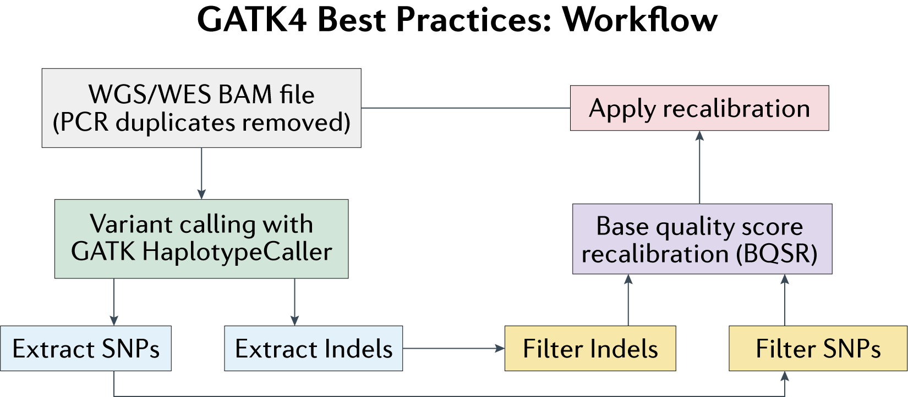

# Calling variants from WES/WGS data using GATK4

Here we will provide a step-by-step guide on using Genome Analysis Toolkit 4 (GATK4) to perform variant calling from WES/WGS data. GATK4 is based on best practices for variant discovery analysis outlined by the Broad Institute. **Disclaimer:** This document is entirely based off of the tutorial provided [here](https://gencore.bio.nyu.edu/variant-calling-pipeline-gatk4/) and merely represents my personal notes. At the start of this document, we assume that the researcher is starting with a BAM file of WES/WGS reads aligned to the reference genome using bwa-mem and that PCR duplicates have been removed from the BAM file. 

## **Dependencies:**
- GATK (v4.2.0.0)
- Picard Tools (v2.23.2)
- Samtools (v1.7)



## **Step 1: Perform the first round of variant calling**
We will perform the first round of variant calling using our BAM file of WES/WGS reads. The variants identified here will be subject to multiple filters and provided as input for base quality score recalibration. To call variants, we can run the following command:
```
# Perform the first round of variant calling
gatk HaplotypeCaller -R [/path/to/reference/genome/FASTA] -I [/path/to/input/BAM/file] -O [/path/to/output/VCF]
```

Note that the reference genome needs to be indexed and have an associated dictionary file. Prior to invoking HaplotypeCaller,  we can run the following Bash commands:

```
# Index reference genome FASTA file (if not indexed already)
samtools faidx [/path/to/reference/genome/FASTA]

# Build a dictionary file for the reference genome
picard CreateSequenceDictionary R=[/path/to/reference/genome/FASTA] O=[/path/to/dictionary/file]
```

## **Step 2: Extract SNPs and Indels**
Given our preliminary VCF of variant calls, we will next separate SNPs from Indels. This can be achieved by running the following command:
```
# Select for SNPs in the input VCF file
gatk SelectVariants -R [/path/to/reference/genome/FASTA] -V [/path/to/input/VCF] -select-type "SNP" -O [/path/to/SNP/VCF]

# Select for Indels in the input VCF file
gatk SelectVariants -R [/path/to/reference/genome/FASTA] -V [/path/to/input/VCF] -select-type "INDEL" -O [/path/to/INDEL/VCF]
```

## **Step 3: Filter SNPs based on best practices**
We will now apply a series of filters recommended by the Broad on our separated set of SNPs. These thresholds, however, are not strict and do not optimally apply to all sequencing datasets. The chosen filters on SNPs are described as follows:
- $QD < 2.0$ - QD is the variant confidence score normalized by the unfiltered depth of non-homozygous reference samples. The purpose of this annotation is to normalize variant quality to avoid inflation due to deep coverage. 
- $FS > 60.0$ - This is a PHRED-scaled probability that there exists strand bias at a given variant site. Strand bias exists when the alternate allele is observed more often or less often on the forward/reverse strand compared to the reference allele. Note that if there is little to no strand bias at a site, our FS score will be close to 0.
- $MQ < 40.0$ - This is the root mean square mapping quality over all of the reads covering a given site (this metric is more sensitive to variation compared to the standard mean). If the mapping quality is good at a site, the MQ value is around 60.
- $SOR > 4.0$ - This is another metric that assesses whether there exists strand bias using a test akin to the symmetric odds ratio test. The SOR metric is better at evaluating strand biases for loci near the ends of exons, which tend to be covered by reads in one direction (the FS score gives those variants a poor score unsurprisingly). 
- $MQRankSum < -12.5$ - This compares the mapping qualities of reads supporting the reference allele and the alternate allele
- $ReadPosRankSum < -8.0$ - This compares whether positions of the reference and alternate allele are different within reads (given the fact that if we only observe an allele towards the end of the read, this could indicate error since sequencing quality drops towards the end of a read)

To apply the filters described above to our set of SNPs, we can run the following command:

```
# Filter SNPs based on recommended thresholds
gatk VariantFiltration -R [/path/to/reference/genome/FASTA] -V [/path/to/SNP/VCF] \
    -O [/path/to/marked/SNP/VCF] \
    --filter-name "QD_filter" -filter "QD < 2.0" \
    --filter-name "FS_filter" -filter "FS > 60.0" \
    --filter-name "MQ_filter" -filter "MQ < 40.0" \
    --filter-name "SOR_filter" -filter "SOR > 4.0" \
    --filter-name "MQRankSum_filter" -filter "MQRankSum < -12.5" \
    --filter-name "ReadPosRankSum_filter" -filter "ReadPosRankSum < -8.0"
```

This will not directly filter out any variants that satisfy the thresholds, but will instead annotated each variant as PASS (none of the filters apply so the variant should be retained) or NO PASS (in which the reason for not passing is indicated). 

## **Step 4: Filter Indels based on best practices**
We will now apply a series of filters recommended by the Broad on our separated set of Indels. Again, these thresholds, are not strict and do not optimally apply to all sequencing datasets. The chosen filters on Indels are described as follows:
- $QD < 2.0$ - QD is the variant confidence score normalized by the unfiltered depth of non-homozygous reference samples. The purpose of this annotation is to normalize variant quality to avoid inflation due to deep coverage. 
- $FS > 200.0$ - This is a PHRED-scaled probability that there exists strand bias at a given variant site. Strand bias exists when the alternate allele is observed more often or less often on the forward/reverse strand compared to the reference allele. Note that if there is little to no strand bias at a site, our FS score will be close to 0.
- $SOR > 10.0$ - This is another metric that assesses whether there exists strand bias using a test akin to the symmetric odds ratio test. The SOR metric is better at evaluating strand biases for loci near the ends of exons, which tend to be covered by reads in one direction (the FS score gives those variants a poor score unsurprisingly). 

To apply the filters described above to our set of Indels, we can run the following command:

```
# Filter Indels based on recommended thresholds
gatk VariantFiltration -R [/path/to/reference/genome/FASTA] -V [/path/to/INDEL/VCF] \
    -O [/path/to/marked/INDEL/VCF] \
    --filter-name "QD_filter" -filter "QD < 2.0" \
    --filter-name "FS_filter" -filter "FS > 200.0" \
    --filter-name "SOR_filter" -filter "SOR > 10.0" 
```

Once again, this will not directly filter out any variants that satisfy the thresholds, but will instead annotated each variant as PASS (none of the filters apply so the variant should be retained) or NO PASS (in which the reason for not passing is indicated). 

## **Step 5: Exclude filtered variants**
Once we have marked which variants should be filtered and which should not be filtered, we can remove SNPs and Indels that should be excluded from downstream analysis. We can apply the following commands to our VCF files:

```
# Exclude filtered SNPs
gatk SelectVariants --exclude-filtered -V [/path/to/marked/SNP/VCF] -O [/path/to/filtered/SNP/VCF]

# Exclude filtered Indels
gatk SelectVariants --exclude-filtered -V [/path/to/marked/Indel/VCF] -O [/path/to/filtered/Indel/VCF]
```

## **Step 6: Perform base quality score recalibration using filtered reads**
Base quality score recalibration (commonly abbreviated as BQSR) is important in variant detection because it aims to minimize the effects of technical variation on base quality scores. The set of filtered SNPs and Indels from the previous steps will be used as a "gold standard" (via bootstrapping) to perform BQSR, which can be achieved by running the following lines of code:

```
# Perform BQSR using our filtered sets of SNPs and Indels
gatk BaseRecalibrator -R [/path/to/reference/genome/FASTA] -I [/path/to/input/BAM/file] --known-sites [/path/to/filtered/SNP/VCF] \
    --known-sites [/path/to/filtered/Indel/VCF] -O [/path/to/recalibration/table]
```

This BQSR step will generate a recalibration table file, which will be used in recalibrating individual reads in our WES/WGS BAM file. 

## **Step 7: Generate a BAM file of recalibrated reads**
This step will apply the recalibration computed in the previous step (captured in the recalibration table) to adjust base quality scores in the original WES/WGS BAM file. Upon recalibration, the BAM file will be ready for use in second-round variant calling. To generate this BAM file of recalibrated reads, we will use the following command:

```
# Generate a BAM file of recalibrated reads
gatk ApplyBQSR -R [/path/to/reference/genome/FASTA] -I [/path/to/input/BAM/file] -bqsr [/path/to/recalibration/table] -O [/path/to/recalibrated/BAM/file]
```

## **Step 8: Perform the second round of variant calling**
We will now perform the second round of variant calling using our BAM file of recalibrated WES/WGS reads. To this end, we can run the following command:
```
# Perform the second round of variant calling
gatk HaplotypeCaller -R [/path/to/reference/genome/FASTA] -I [/path/to/recalibrated/BAM/file] -O [/path/to/output/VCF]
```

## **Step 9: Extract SNPs and Indels**
From our VCF of second-round variant calls, we will next separate SNPs from Indels. This can be achieved by running the following command:
```
# Select for SNPs in the input VCF file
gatk SelectVariants -R [/path/to/reference/genome/FASTA] -V [/path/to/input/VCF] -select-type "SNP" -O [/path/to/SNP/VCF]

# Select for Indels in the input VCF file
gatk SelectVariants -R [/path/to/reference/genome/FASTA] -V [/path/to/input/VCF] -select-type "INDEL" -O [/path/to/INDEL/VCF]
```

## **Step 10: Filter SNPs based on best practices**
We will again apply the same series of filters recommended by the Broad on our separated set of SNPs (as done previously in Step 3) using the following command:

```
# Filter SNPs based on recommended thresholds
gatk VariantFiltration -R [/path/to/reference/genome/FASTA] -V [/path/to/SNP/VCF] \
    -O [/path/to/marked/SNP/VCF] \
    --filter-name "QD_filter" -filter "QD < 2.0" \
    --filter-name "FS_filter" -filter "FS > 60.0" \
    --filter-name "MQ_filter" -filter "MQ < 40.0" \
    --filter-name "SOR_filter" -filter "SOR > 4.0" \
    --filter-name "MQRankSum_filter" -filter "MQRankSum < -12.5" \
    --filter-name "ReadPosRankSum_filter" -filter "ReadPosRankSum < -8.0"
```

## **Step 11: Filter Indels based on best practices**
We will also apply a series of filters recommended by the Broad on our separated set of Indels (as done in Step 4) using the following command:

```
# Filter Indels based on recommended thresholds
gatk VariantFiltration -R [/path/to/reference/genome/FASTA] -V [/path/to/INDEL/VCF] \
    -O [/path/to/marked/INDEL/VCF] \
    --filter-name "QD_filter" -filter "QD < 2.0" \
    --filter-name "FS_filter" -filter "FS > 200.0" \
    --filter-name "SOR_filter" -filter "SOR > 10.0" 
```

## **Step 12: Exclude filtered variants**
Once we have marked which variants should be filtered and which should not be filtered, we can remove SNPs and Indels that should be excluded. We can apply the following commands to our VCF files:

```
# Exclude filtered SNPs
gatk SelectVariants --exclude-filtered -V [/path/to/marked/SNP/VCF] -O [/path/to/filtered/SNP/VCF]

# Exclude filtered Indels
gatk SelectVariants --exclude-filtered -V [/path/to/marked/Indel/VCF] -O [/path/to/filtered/Indel/VCF]
```